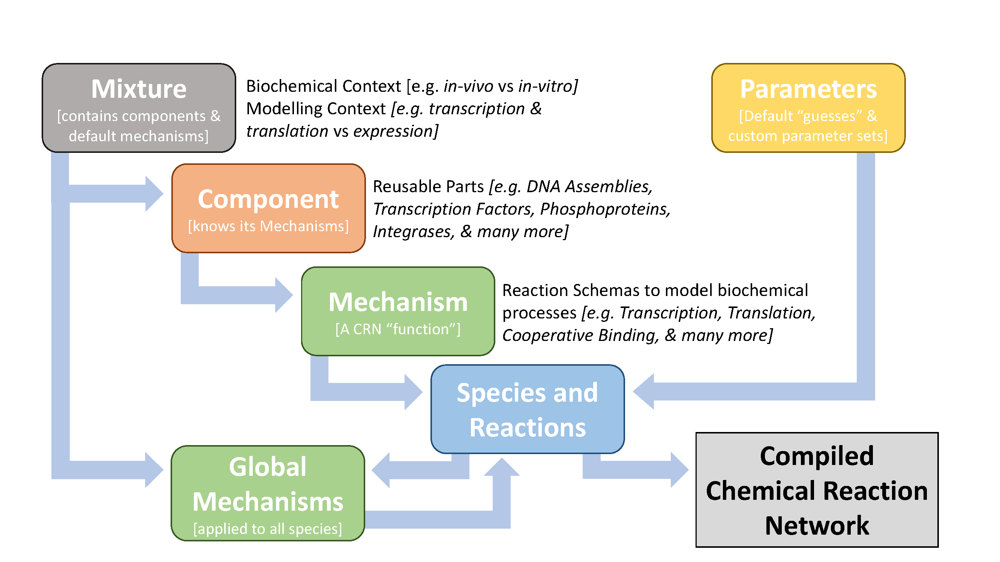
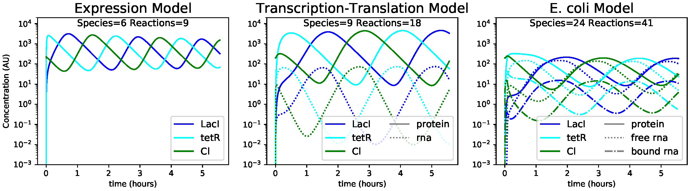
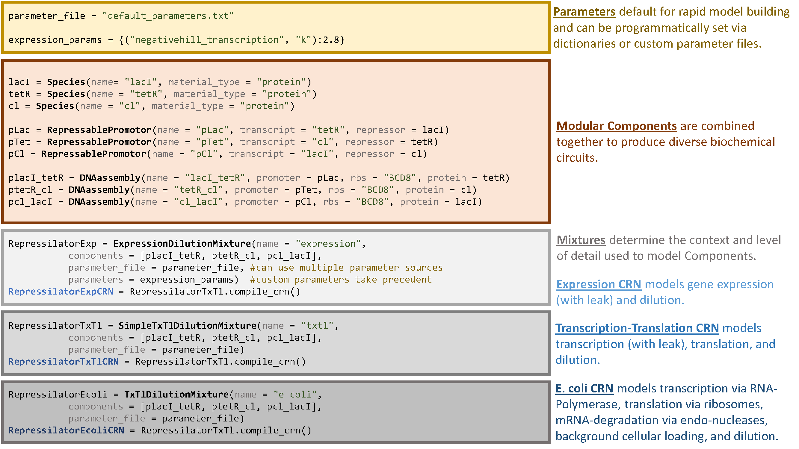

************
Introduction
************

This chapter provides a brief introduction to BioCRNpyler.  A more
detailed introduction to the package is available in [Poo+22]_.

Motivation and Background
=========================

Chemical reaction networks (CRNs) are commonly used for modeling in
systems and synthetic biology [Alo19]_, [DVM14]_.  The power of CRNs lies in
their expressivity; CRN models can range from physically realistic
descriptions of individual molecules to coarse-grained idealizations
of complex multi-step processes [DVM14]_.  However, this expressivity comes
at a cost -- frequently choosing the right level of detail in a model
is more an art than a science.  The modeling process requires careful
consideration of the desired use of the model, the available data to
parameterize the model, and prioritization of certain aspects of
modeling or analysis over others.

The available tools for a CRN modeller are vast and include: extensive
software to generate and simulate CRNs, databases of models, model
analysis tools, and many more [SB22]_, [Som+15]_, [LeN+06]_,
[Hoo+06]_, [Cho+18]_.  However, relatively few tools exist to aid in
the automated construction of CRN models from simple specifications.
For example, even though synthetic biologists have taken a module and
part-driven approach to their laboratory work [BS05]_, models are
still typically built by hand on a case-by-case basis.

The BioCRNpyler [1]_ package is a software framework and library designed
to aid in the rapid construction of models from common motifs, such as
molecular components, biochemical mechanisms and parameter sets.  These
parts can be reused and recombined to rapidly generate CRN models in
diverse chemical contexts at varying levels of model complexity.  Some
similar tools exist including [Mye+09]_,
[Har+16]_, [Tuz+13]_.

What makes BioCRNpyler unique is an open-source and object-oriented
framework written in Python which allows complete control over model
compilation by developers as well as a large library of easy-to-use
parts and models relevant to synthetic biologists and
bio-engineers.  The BioCRNpyler package is available on `GitHub
<https://github.com/BuildACell/BioCRNPyler>`_ [BCP-GH]_.

The BioCRNpyler Framework
=========================

BioCRNpyler is an open-source Python framework (:ref:`Figure 1.1
<fig-overview>`) that compiles high-level specifications into detailed
CRN models saved as SBML [Huc+23]_.  Specifications may
include: biomolecular Components, modeling assumptions (Mechanisms),
biochemical context (Mixtures), and Parameters.  BioCRNpyler is
written in Python with a flexible object-oriented design, extensive
documentation, and detailed examples to allow for easy model
construction by modelers as well as customization and extension by
developers.

.. _fig-overview:

   Figure 1.1. The hierarchical organization of classes in the BioCRNpyler
   framework.  Arrows represent compilation.

**Species and Reactions** make up a CRN and are the output of
BioCRNpyler compilation.  Many sub-classes exist such as
``ComplexSpecies`` and reactions with different kinds of rate function
(e.g.  mass-action, Hill functions, etc).

**Mechanisms** are reaction schemas, which can be thought of as
abstract functions that produce CRN Species and Reactions.  They
represent a particular molecular process, such as transcription or
translation.  During compilation, Mechanisms are called by
Components.  **Global Mechanisms** are called at the end of compilation
in order to affect all species of a given type or with given
attributes — for example, dilution of all protein Species.

**Components** are reusable parts; they know what kinds of Mechanisms
affect them but are agnostic to the underlying schema.  For example, a
promoter is a Component which will call a transcription Mechanism;
similarly, a Ribosome Binding Site (RBS) is a Component which will
call a translation Mechanism.  However, the same Promoter and RBS can
use many different transcription and translation Mechanisms depending
on the modeling context and detail desired.

.. _fig-simulations:

   Figure 1.2. Using BioCRNpyler to compile the repressilator at
   various levels of detail.  Simulation parameters come from the
   repressilator paper [Elo+00]_ and [Cer+15]_, [Mil+15]_.
   Simulations were carried out with Bioscrape [Swa+19]_.

**Mixtures** are sets of default Mechanisms and Components that
represent different molecular and modeling contexts.  As an example of
molecular context, a cell-extract model requires reactions to consume
a finite supply of fuel, while a steady-state model of living cells
does not have a limited fuel supply.  As an example of modeling
context, a simple model of gene expression may have a gene
catalytically create a protein product, while a more complex model
might include cellular machinery such as RNA polymerase and ribosomes
with Michaelis-Menten kinetics.

**Parameters** are designed for flexibility; they can default to
biophysically plausible values (such as a default binding rate), be
shared between Components and Mechanisms, or have specific values for
Component-Mechanism combinations.  This system is designed so that
models can be produced quickly without full knowledge of all
parameters and then refined with detailed parameter files later.

.. _fig-code:

   Figure 1.3. Python code generating three repressilator CRNs.

The BioCRNpyler Library
=======================

The BioCRNpyler library contains a growing collection of Mechanisms,
Components, and Mixtures as well as extensive Jupyter
notebooks.  Currently, this library is geared towards synthetic
biological applications with numerous Mechanisms for transcription,
translation, gene regulation, catalysis, molecular binding and many
more.  Components include common synthetic biological parts such as
Promoters, RBSs which can be combined into DNA-assemblies to produce
RNA and Proteins, as well as more specific parts such as dCas9.

Mixtures include both models of cell-like systems growing at steady
state and extract-like systems with finite resources.  Importantly,
for different modeling contexts, BioCRNpyler includes `Mixtures` with
different default levels of complexity.  The ease in generating
increasingly complex models is illustrated in :ref:`Figure 1.3
<fig-code>`, which shows code to compile a repressilator from a few
common Components into multiple CRNs of very different levels of
complexity.  Simulations from these models are shown in :ref:`Figure
1.2 <fig-simulations>`.

References
==========

.. [Alo19] U.  Alon, *An Introduction to Systems Biology:
   Design Principles of Biological Circuits*.  CRC Press, 2019.

.. [BS05] Benner SA, Sismour AM.  Synthetic
   biology.  Nature Reviews Genetics.  2005;6(7):533–543.

.. [Cer+15] Ceroni F, Algar R, Stan GB, Ellis T, Quantifying cellular
   capacity identifies gene expression designs with reduced
   burden. *Nature Methods*. 2015 May;12(5):415-8. doi:
   10.1038/nmeth.3339.

.. [Cho+18] Choi K, Medley JK, König M, Stocking K, Smith
   L, Gu S, et al.  Tellurium: an extensible python- based modeling
   environment for systems and synthetic
   biology.  Biosystems.  2018;171:74–79.

.. [DVM14] D.  D.  Vecchio and R.  M.  Murray.  *Biomolecular Feedback
   Systems*.  Princton University Press, 2014.

.. [Elo+00] Elowitz MB, et al.  A synthetic oscillatory
   network of transcriptional regulators.  Nature.
   2000;403(6767):335–338.

.. [Har+16] Harris LA, et al.  BioNetGen 2.2: advances in
   rule-based modeling.  Bioinformatics.   2016;32(21):3366–3368.

.. [Hoo+06] S. Hoops, S. Sahle, R. Gauges, C. Lee, J. Pahle, N. Simus, M. Singha
    l, L. Xu, P. Mendes, U. Kummer, COPASI—a COmplex PAthway
    SImulator, *Bioinformatics*.  22(24):3067–3074, 2006.
    https://doi.org/10.1093/bioinformatics/btl485
    
.. [Huc+23] Hucka M, et al.  The systems biology markup
   language (SBML): a medium for representation and exchange of
   biochemical network models.  Bioinformatics.  2003;19(4):524–531.

.. [LeN+06] Le Novere N, Bornstein B, Broicher A, Courtot M,
   Donizelli M, Dharuri H, et al.  BioModels Database: a free,
   centralized database of curated, published, quantitative kinetic
   models of biochemical and cellular systems.  Nucleic acids
   research.  2006;34(suppl_1):D689–D691.

.. [Mil+15] Milo R, et al.  Cell biology by the numbers.  Garland
   Science; 2015.

.. [Mye+09] Myers CJ, et al.  iBioSim: a tool for the
   analysis and design of genetic circuits.  Bioinformatics.
   2009;25(21):2848–2849.

.. [Poo+22] Poole W, Pandey A, Shur A, Tuza ZA, Murray RM (2022)
   BioCRNpyler: Compiling chemical reaction networks from biomolecular
   parts in diverse contexts. *PLOS Computational Biology* 18(4):
   e1009987. https://doi.org/10.1371/journal.pcbi.1009987

.. [BCP-GH] BioCRNpyler Github Repository; 2025.
   https://github.com/BuildACell/BioCRNpyler.

.. [SB22] The MathWorks, Inc.  MATLAB Simbiology
   Toolbox; 2022.  Available from: https://www.
   mathworks.com/help/simbio/.

.. [Som+15] Somogyi ET, Bouteiller JM, Glazier JA,
   König M, Medley JK, Swat MH, et al.  libRoadRunner: a high
   performance SBML simulation and analysis
   library.   Bioinformatics.  2015;31(20):3315–3321.

.. [Swa+19] Swaminathan A, et al.  Fast and flexible
   simulation and parameter estimation for synthetic biology using
   bioscrape.  bioRxiv.  2019; p.  121152.

.. [Tuz+13] Tuza ZA, et al.  An in silico modeling toolbox for
   rapid prototyping of circuits in a biomolecular “breadboard”
   system.  In: 52nd IEEE Conference on Decision and
   Control; 2013.  p.  1404–1410.

.. rubric:: Footnotes

.. [1] Pronounced as bio-compiler
