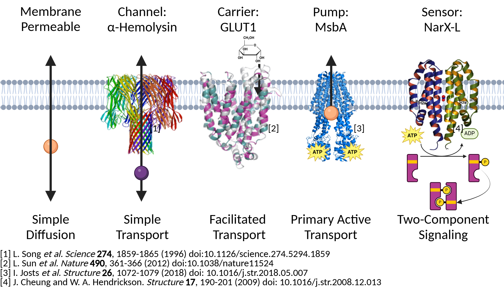
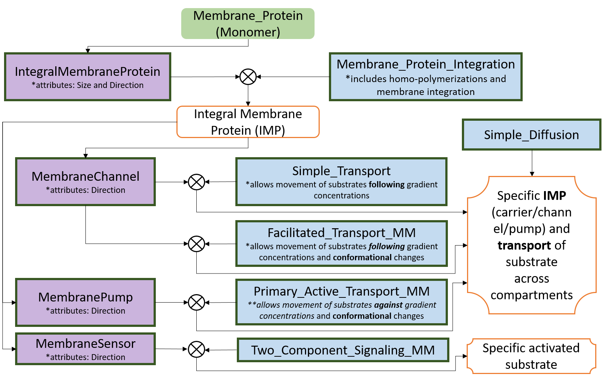

==============================
Membrane-Associated Components and Mechanisms
==============================

The following Jupyter notebooks provide a set of tutorial
introductions to BioCRNpyler's membrane-associate features.

-------------
Introduction
-------------

BioCRNpyler supports modeling genetic circuits with membrane-associated 
features using computational tools. This functionality enables users to 
construct and simulate genetic circuits that incorporate membrane components 
and mechanisms within simplified cell-free system models. 
 

BioCRNpyler's membrane-associated features allow for the representation of 
inducer dynamics, including diffusion across membranes or transport via 
channels and transporters. This facilitates the design and refinement of models 
that connect mechanistic biology with computational analysis, bridging the gap 
between conceptual design and experimental implementation in synthetic biology.

~~~~~~~~~~~~~~~~~~
Membrane Component
~~~~~~~~~~~~~~~~~~
The following membrane-associated component that are available in BioCRNpyler:

- ``DiffusibleMolecule()``:
- ``IntegralMembraneProtein()``:
- ``MembraneChannel()``:
- ``MembranePump()``:
- ``MembraneSensor()``:

~~~~~~~~~~~~~~~~~~~~~~~~~~~~~~
Membrane Mechanisms
~~~~~~~~~~~~~~~~~~~~~~~~~~~~~~
The following membrane-associated mechanisms that are available in BioCRNpyler:

- ``Simple_Diffusion()``: Models the passive movement of
 small, nonpolar molecules across the membrane, driven by concentration gradients, 
 without the need for membrane proteins or energy input.

- Membrane protein-mediated mechanisms
    - ``Membrane_Protein_Integration()``: Models 
    the the insertion and proper orientation of proteins into the membrane, ensuring 
    their structural and functional integration within the lipid bilayer.

    - ``Simple_Transport()``: Models the passive movement of 
    substrates through membrane pores/channels along concentration gradients, without 
    requiring energy input.

    - ``Facilitated_Transport()``: Models the passive 
    movement of substrates along concentration gradients by binding to carrier 
    proteins that undergo conformational changes, without requiring energy input.
  
    - ``Primary_Active_Transport()``: Models the 
    active movement of substrates against concentration gradients by binding to membrane 
    pumps, which undergo conformational changes driven by energy input (e.g., ATP).

    - ``Two_Component_Signaling()``: Models the environmental 
    sensing through a signaling pathway involving a sensor kinase and phosphorylation of a 
    response regulator protein, enabling adaptive cellular responses.

~~~~~~~~~~~~~~~~~~~~~~~~~~~~~~
Compiling Chemical Reaction Networks with Membrane Features
~~~~~~~~~~~~~~~~~~~~~~~~~~~~~~

**Overview:** The membrane modeling capabilities of BioCRNpyler allow users to build 
complex chemical reaction networks (CRNs) involving membrane-associated components and 
transport mechanisms from modular, high-level specifications.

The figure presented above illustrates the various options available for modeling transport 
and two-component signaling within BioCRNpyler. It specifically highlights the membrane 
components, indicated by purple boxes, along with their corresponding mechanisms, represented 
by the blue box.

----------------
Diffusible Molecule
----------------
~~~~~~~~~~
Component: ``DiffusibleMolecule()``
~~~~~~~~~~

A Diffusible Molecule refers to a class of molecules that can pass through cell membranes 
without assistance. Examples of such molecules include gases like oxygen (O sub 2 /sub) and 
carbon dioxide (CO sub 2 /sub), as well as small polar but uncharged molecules. In contrast, 
larger uncharged molecules and charged molecules require membrane proteins for transport across 
the membrane.

The following code defines a diffusible molecule called ``S``:

.. code-block:: python

    S = DiffusibleMolecule('name')

Unless otherwise specified, the species ``S`` will reside in the ``internal`` compartment.  
The membrane component ``DiffusibleMolecule(Component)`` will then create a species ``product``,  
which is a copy of ``S`` but located in the ``external`` compartment.

To access more information about this component, use:

.. code-block:: python

    help(DiffusibleMolecule)

.. _simple-diffusion:

~~~~~~~~~~~~~~~~~~~~~~~~~~~~~~
Mechanism: ``Simple_Diffusion()``
~~~~~~~~~~~~~~~~~~~~~~~~~~~~~~

Simple diffusion allows molecules to passively cross membranes down their concentration 
gradient. This is the most basic mechanism by which molecules can traverse a membrane, commonly 
referred to as passive diffusion. In this process, a molecule can dissolve in the lipid bilayer, 
diffuse across it, and reach the other side. This mechanism does not require the assistance of 
membrane proteins, and the transport direction is determined by the concentration gradient, 
moving from areas of high concentration to areas of low concentration.

In BioCRNpyler, the ``DiffusibleMolecule`` component uses the mechanism ``Simple_Diffusion``, 
which can be defined as:

.. code-block:: python

    mech_tra = Simple_Diffusion()
    transport_mechanisms = {mech_tra.mechanism_type: mech_tra}

~~~~~~~~~~
Example 1: Diffusion of nitrate
~~~~~~~~~~

Consider the following diffusion step for the diffusion of nitrate (NO 3).

.. math::

    NO3_{internal} \rightleftharpoons NO3_{external}

To model the example above using the ``Diffusible_Molecule`` component and the ``Simple_Diffusion`` 
mechanism, we must first define the diffusible molecule and then incorporate it into a mixture 
using the mechanism to construct a CRN.

.. code-block:: python

    # Define diffusible molecule
    NO3 = DiffusibleMolecule('NO3')

    # Mechanisms
    mech_tra = Simple_Diffusion()
    transport_mechanisms = {mech_tra.mechanism_type: mech_tra}

    # Create mixture
    M0 = Mixture("Diffusible_Molecule", components=[NO3],
                 parameter_file="membrane_toolbox_parameters.txt",
                 mechanisms=transport_mechanisms)

    # Compile the CRN with Mixture.compile_crn
    CRN = M0.compile_crn()

    # Print the CRN to see what you created
    print(CRN.pretty_print())

**Console Output:**

.. code-block:: text

    Species(N = 2) = {NO3 (@ 0),  NO3 (@ 0),}

    Reactions (1) = [
    0. NO3 <--> NO3
     Kf=k_forward * NO3_Internal
     Kr=k_reverse * NO3_External
      k_forward=0.0002
      found_key=(mech=simple_diffusion, partid=None, name=k_diff).
      search_key=(mech=simple_diffusion, partid=NO3, name=k_diff).
      k_reverse=0.0002
      found_key=(mech=simple_diffusion, partid=None, name=k_diff).
      search_key=(mech=simple_diffusion, partid=NO3, name=k_diff).

    ]

-------------
Integral Membrane Protein
-------------

~~~~~~~~~~
Component: ``IntegralMembraneProtein()``
~~~~~~~~~~

Integral Membrane Proteins refer to a class of proteins embedded within the lipid bilayer of 
cellular membranes. These proteins typically span the membrane and play essential roles in transport, 
signaling, and structural support. Once integrated, they can mediate the movement of other molecules 
or relay signals across the membrane.

The following code defines an integral membrane protein component called ``IMP``. It requires two inputs: 
``membrane_protein`` and ``product``, which can be either strings or ``Species`` objects.

.. code-block:: python

    IMP = IntegralMembraneProtein(membrane_protein = "MP", product = "P")

Optional arguments can also be supplied to control transport direction, stoichiometry, and compartment:

.. code-block:: python

    IMP = IntegralMembraneProtein(
        membrane_protein="MP",
        product="P",
        direction=None,
        size=None,
        compartment="Internal",
        membrane_compartment="Membrane",
        cell=None,
        attributes=None
    )

**Key Optional Parameters**

``direction``: Specifies the transport direction with `'Exporter'`, `'Importer'`, or `'Passive'` 
(default) options. The default value of `'Passive'` indicates that the internal membrane protein is 
embedded in the membrane. This default may apply to non-transporter proteins or unidirectional 
transporters.  The flux of the substrates, based on the `'direction`', follows the general transport 
below.
  - Exporter: :math:`S_{in} \rightarrow S_{out}`  
  - Importer: :math:`S_{in} \leftarrow S_{out}`  
  - Passive: :math:`S_{in} \leftrightarrow S_{out}`

``size``: Defines the number of monomers required for the integral membrane used in `'Membrane_Protein_Integration()'`
and the subsequent reactions.. For homo-oligomer membrane proteins, we can include an input for `'size'`
as either a numerical string or an integer.
  - If provided:  
    :code:`monomer * size → oligomer → integral_membrane_protein`  
  - If not:  
    :code:`monomer → integral_membrane_protein`

.. _membrane—protein-integration:

~~~~~~~~~~
Mechanism: ``Membrane_Protein_Integration()``
~~~~~~~~~~

Membrane protein integration models the process by which proteins are inserted into the lipid 
bilayer of a membrane. This mechanism ensures that membrane proteins are correctly localized 
and oriented within the membrane, a crucial step for their function in transport, signaling, or 
structural roles. The mechanism does not model active transport or signaling directly, but provides 
the foundational step of embedding proteins into the membrane where they can carry out these roles.

The ``IntegralMembraneProtein`` component uses the ``Membrane_Protein_Integration`` mechanism. The 
mechanism for integrating membranes can be implemented and stored in a dictionary.

.. code-block:: python

    mech_integration = Membrane_Protein_Integration()
    integration_mechanisms = {mech_integration.mechanism_type: mech_integration}

~~~~~~~~~~
Example 2: Integration of alpha-hemolysin
~~~~~~~~~~

Consider the following membrane integration steps for alpha-hemolysin.
1. **Assemble into a homoheptamer:**

.. math::

    7\alpha HL_{monomer} \rightarrow \alpha HL_{homoheptamer}

2. **Integration of membrane protein in membrane:**

.. math::

    \alpha HL_{homoheptamer} \rightarrow \alpha HL_{channel}

To model the example above using the ``IntegralMembraneProtein `` component and the ``Membrane_Protein_Integration`` 
mechanism, we must first define the integral membrane protein (e.g., alpha-hemolysin) and then 
incorporate it into a mixture using the integration mechanism to construct a CRN. 

.. code-block:: python

    # Define membrane protein
    alphaHL = IntegralMembraneProtein('alphaHL_monomer', product='alphaHL',
                                              size=7)
    # Instantiate a mechanism for membrane integration
    mech_integration = Membrane_Protein_Integration()
    
    # Mechanisms
    integration_mechanisms = {mech_integration.mechanism_type: mech_integration}

    # Create mixture
        M = Mixture("alphaHL", components=[alphaHL_monomer],
                    parameter_file="membrane_toolbox_parameters.txt",
                    mechanisms=integration_mechanisms)

    #Compile the CRN and print
        CRN = M.compile_crn()
        print(CRN.pretty_print())

**Console Output:**

.. code-block:: text

    Species(N = 3) = {
    complex[7x_protein[alphaHL_monomer]] (@ 0),  protein[alphaHL_monomer] (@ 0),  protein[alphaHL(Passive)] (@ 0),  
    }

    Reactions (2) = [
    0. 7protein[alphaHL_monomer] <--> complex[7x_protein[alphaHL_monomer]]
    Kf=k_forward * protein_alphaHL_monomer_Internal^7
    Kr=k_reverse * complex_protein_alphaHL_monomer_Internal_7x_
    k_forward=0.002
    found_key=(mech=membrane_protein_integration, partid=None, name=kb_oligmor).
    search_key=(mech=membrane_protein_integration, partid=alphaHL_monomer, name=kb_oligmor).
    k_reverse=2e-10
    found_key=(mech=membrane_protein_integration, partid=None, name=ku_oligmor).
    search_key=(mech=membrane_protein_integration, partid=alphaHL_monomer, name=ku_oligmor).

    1. complex[7x_protein[alphaHL_monomer]] --> protein[alphaHL(Passive)]
    Kf = k complex[7x_protein[alphaHL_monomer]] / ( 1 + (protein[alphaHL(Passive)]/K)^4 )
    k=10.0
    found_key=(mech=membrane_protein_integration, partid=None, name=kex).
    search_key=(mech=membrane_protein_integration, partid=alphaHL_monomer, name=kex).
    K=0.5
    found_key=(mech=membrane_protein_integration, partid=None, name=kcat).
    search_key=(mech=membrane_protein_integration, partid=alphaHL_monomer, name=kcat).
    n=4

]

-------------
Membrane Channels 
-------------

~~~~~~~~~~
Component: ``MembraneChannel()``
~~~~~~~~~~

Membrane channels refer to a class of proteins, a subclass of integral membrane proteins, that 
are pore-forming and create gated pathways across the lipid bilayer. They allow specific molecules 
or ions to pass through the membrane and play key roles in regulated transport, enabling the movement 
of substrates in response to concentration gradients or signaling events.

The following code defines an membrane channel component called ``MC``. It requires two 
inputs: ``integral_membrane_protein`` and `` substrate``, which can be either strings or ``Species`` 
objects.

.. code-block:: python

    MC = MembraneChannel(integral_membrane_protein= "IMP", substrate = "S)

The component also accepts optional inputs, similar to the `IntegralMembraneProtein`. However, if 
the `integral membrane protein`` has already been defined using `IntegralMembraneProtein()`, the `MembraneChannel` 
will inherit its `direction` and `compartment` properties from the existing species (e.g., ``IMP``).

The ``MembraneChannel`` component can uses the ``Simple_Transport`` or ``Facilitated_Transport_MM`` 
mechanism. The choice of mechanism depends on the biological behavior of the channel. You can choose 
from one of the following options:

- **Simple_Transport**  
  Allows bidirectional movement of substrates, following the concentration gradient. The `direction` 
  of the membrane channel must be set to ``Passive``.

- **Facilitated_Transport_MM**  
  Allows unidirectional movement of substrates, also along the concentration gradient. The `direction` 
  of the membrane channel must be either ``Importer`` or ``Exporter``.

.. _simple-transport:

~~~~~~~~~~
Mechanism: ``Simple_Transport()``
~~~~~~~~~~

Simple transport models the passive movement of substrates across the membrane through protein channels 
or pores. This mechanism enables molecules to move down their concentration gradient without energy input. 
It assumes the channel is always open or allows diffusion based on molecular properties, and does not 
involve binding or conformational changes.

The ``Simple_Transport()`` mechanism involves a one-step reaction followinf the resulting reaction is 
a reversible diffusion-like process:

.. math::

    S_{internal} + MC \leftrightarrow S_{external} + MC

The mechanism for simple transport can be implemented and stored in a dictionary.

.. code-block:: python

    mech_transport = Simple_Transport()
    transport_mechanisms = {mech_transport.mechanism_type: mech_transport}

~~~~~~~~~~~~~~~~~~~~~~~~~~~~~~
Example 3: Transport by alpha-hemolysin
~~~~~~~~~~~~~~~~~~~~~~~~~~~~~~

Consider the following reaction of the transport of ATP through the alpha-hemolysin pore:

.. math::

    ATP_{internal} + \alpha HL_{channel} \leftrightarrow ATP_{external} + \alpha HL_{channel}

To model the example above using the ``Membrane_Channel`` component and the ``Simple_Transport`` 
mechanism, we use the previously defined integral membrane protein (e.g., alphaHL) represented by 
``alphaHL_monomer.product`` and incorporate it into a mixture with the transport mechanism to construct 
a CRN that enables passive transport across the membrane.

.. code-block:: python

    # Define membrane channel
    alphaHL_channel = MembraneChannel(alphaHL_monomer.product, substrate ="ATP")    
    # Mechanisms
    mech_transport = Simple_Transport()
    transport_mechanisms = {mech_transport.mechanism_type:mech_transport}

    # Create mixture
        M = Mixture("aHL_transport", components = [alphaHL_channel],
                parameter_file = "membrane_toolbox_parameters.txt",
                mechanisms = transport_mechanisms)

    #Compile the CRN and print
        CRN = M.compile_crn()
        print(CRN.pretty_print())

**Console Output:**

.. code-block:: text

    Species(N = 3) = {
    protein[alphaHL(Passive)] (@ 0),  ATP (@ 0),  ATP (@ 0),  
    }

    Reactions (1) = [
    0. ATP+protein[alphaHL(Passive)] <--> ATP+protein[alphaHL(Passive)]
    Kf=k_forward * ATP_Internal * protein_alphaHL_Passive
    Kr=k_reverse * ATP_External * protein_alphaHL_Passive
    k_forward=0.1
    k_reverse=0.1

    ]

.. _facilitated-transport:

~~~~~~~~~~
Mechanism: ``Facilitated_Transport_MM()``
~~~~~~~~~~
Facilitated transport captures the transport of substrates across the membrane with the assistance of 
specific carrier proteins. These proteins bind to the substrate and undergo conformational changes 
to move the molecule from one side of the membrane to the other. Although no energy is required, the 
process is selective and directional, following the substrate’s concentration gradient.

The ``Facilitated_Transport_MM()`` mechanism involves binding, translocation, and unbinding steps. 
For example, if the membrane channel is an **importer**, the resulting reactions are:

1. **Binding and transport of substrate (`S`) across the membrane:**

.. math::

    S_{external} + MC \rightarrow S_{external}:MC_{channel} \rightarrow S_{internal}:MC 

2. **Unbinding substrate from transporter:**

.. math::

    S_{internal}:MC_{channel} \rightarrow S_{internal} + MC_{channel}
To use ``Facilitated_Transport_MM()``, we need to redefine the membrane channel to include a transport 
direction designation, such as ``Importer`` or ``Exporter``. For example:

.. code-block:: python

    MC = MembraneChannel(integral_membrane_protein="IMP", substrate="S",     
                         direction='Importer')
Then the mechanism for facilitated transport can be implemented and stored in a dictionary.

.. code-block:: python

    mech_transport = Facilitated_Transport()
    transport_mechanisms = {mech_transport.mechanism_type: mech_transport}

~~~~~~~~~~~~~~~~~~~~~~~~~~~~~~
Example 4: Transport of glucose by GLUT1
~~~~~~~~~~~~~~~~~~~~~~~~~~~~~~~~~~~~~~~~

Consider the following reactions of the transport of glucose by GLUT1.

1. **Integration of membrane protein in membrane:**

.. math::

    GLUT1_{monomer} \rightarrow GLUT1_{channel}

2. **Binding and transport of glucose across membrane:**

.. math::

    glucose_{external} + GLUT1_{channel} \rightarrow glucose_{external}:GLUT1_{channel} \rightarrow glucose_{internal}:GLUT1_{channel}

3. **Unbinding glucose from transporter:**

.. math::

    glucose_{internal}:GLUT1_{channel} \rightarrow glucose_{internal} + GLUT1_{channel}

To model the example above using the ``MembraneChannel`` component and the ``Facilitated_Transport_MM`` 
mechanism, we can either redefine the "Membrane_Channel" component or the integral membrane protein GLUT1 
using the "IntegralMembraneProtein" component to incorporate directionality.

The following example begins by defining the integral membrane protein, including the specification of its 
transport direction.

.. code-block:: python

    # Define integral membrane protein
    glut1 = IntegralMembraneProtein('glut1', product='glut1_channel',
                                    direction='Importer', size= 1)

    # Define membrane channel
    glut1_channel = MembraneChannel(glut1.product, substrate='glucose')

    # Mechanisms
    mech_integration = Membrane_Protein_Integration()
    mech_transport = Facilitated_Transport_MM()

    all_mechanisms = {mech_integration.mechanism_type:mech_integration,
                    mech_transport.mechanism_type:mech_transport}

    # Create mixture
        M = Mixture(components=[glut1, glut1_channel],
            mechanisms=all_mechanisms,
            parameter_file = "membrane_toolbox_parameters.txt") 

    #Compile the CRN and print
        CRN = M.compile_crn()
        print(CRN.pretty_print(show_keys=False))

**Console Output:**

.. code-block:: text
    Species(N = 6) = {
    protein[glut1_channel(Importer)] (@ 0),  protein[glut1] (@ 0),  complex[glucose:protein[glut1_channel]] (@ 0),  
    complex[glucose:protein[glut1_channel]] (@ 0),  glucose (@ 0),  glucose (@ 0),  
    }

    Reactions (5) = [
    0. protein[glut1] --> protein[glut1_channel(Importer)]
    Kf = k protein[glut1] / ( 1 + (protein[glut1_channel(Importer)]/K)^4 )
    k=10.0
    K=0.5
    n=4

    1. glucose+protein[glut1_channel(Importer)] --> complex[glucose:protein[glut1_channel]]
    kb_subMC*glucose_External*protein_glut1_channel_Importer*Heaviside(glucose_External-glucose_Internal)-kb_subMC*glucose_Internal*protein_glut1_channel_Importer*Heaviside(glucose_External-glucose_Internal)
    kb_subMC=0.1

    2. complex[glucose:protein[glut1_channel]] --> protein[glut1_channel(Importer)]+glucose
    Kf=k_forward * complex_glucose_External_protein_glut1_channel_Importer_
    k_forward=0.1

    3. complex[glucose:protein[glut1_channel]] --> complex[glucose:protein[glut1_channel]]
    Kf=k_forward * complex_glucose_External_protein_glut1_channel_Importer_
    k_forward=0.01

    4. complex[glucose:protein[glut1_channel]] --> glucose+protein[glut1_channel(Importer)]
    Kf=k_forward * complex_glucose_Internal_protein_glut1_channel_Importer_
    k_forward=0.1

    ]

-------------
Membrane Pumps 
-------------

~~~~~~~~~~
Component: ``MembranePump()``
~~~~~~~~~~
Membrane pumps are a class of transport proteins, also considered a subclass of integral membrane proteins, 
that actively move molecules or ions across the lipid bilayer. Unlike passive channels, pumps use energy, 
typically from ATP or an electrochemical gradient, to drive the transport of substrates against their concentration 
gradients.

The following code defines a membrane pump component called ``MC``. It requires two inputs: `` integral_membrane_protein`` 
and `` substrate``, which can be either strings or ``Species`` objects.

.. code-block:: python

    MP = MembranePump(membrane_pump= "MP", substrate = "S") 
The component also accepts optional inputs, similar to the `IntegralMembraneProtein`. However, if the integral membrane 
protein has already been defined using `IntegralMembraneProtein`, the `MembranePump` will inherit its `direction` and 
`compartment` properties from the existing species (e.g., ``IMP``). 

Optional arguments can also be supplied to control transport direction, stoichiometry, and compartment:

.. code-block:: python

MP = MembranePump(membrane_pump= "MP", substrate = "S",
                  direction = None,
                  internal_compartment ='Internal',
                  external_compartment ='External',
                  ATP = None, cell = None, attributes=None)

**Key Optional Parameters**

``ATP``: An optional input for the membrane pump is designated as 'ATP.' In the absence of a specified integer value 
for 'ATP,' the model will default to a value of 1.
``direction``: By default, the ``direction`` is set to ``None``, which will generate a CRN corresponding to an exporter 
behavior. (check this, if true then okay) in reference to what?<--check, what if the membrane protein is inverted??

The `` MembranePump`` component can uses the `` Primary_Active_Transport_MM()`` mechanism.
~~~~~~~~~~
Mechanism: `` Primary_Active_Transport_MM()``
~~~~~~~~~~
Primary active transport describes the energy-dependent movement of substrates across the membrane, typically against 
their concentration gradient. This process is carried out by specialized membrane pumps that bind to the substrate and 
undergo conformational changes powered by energy sources such as ATP hydrolysis. The transport is both selective and 
directional. 

The ``Primary_Active_Transport_MM()`` mechanism captures this behavior through binding, energy-driven conformational 
changes, and unbinding steps. For example, if the membrane pump is defined as an **exporter**, the resulting reactions are: 

1. * **Binding of antibiotic substrate (S) to membrane pump (MP):**

.. math::

    S_{internal} + MP_{exporter} \rightleftharpoons S_{internal}:MP_{exporter}

2. **Binding of ATP to the complex of S with MP:**

.. math::

    ATP_{internal} + S_{internal}:MP_{exporter} \rightleftharpoons ATP_{internal}:S_{internal}:MP_{exporter}

3. **Export of S from the internal compartment to the external compartment:**

.. math::

    ATP_{internal}:S_{internal}:MP_{exporter} \rightarrow ATP_{internal}:S_{external}:MP_{exporter}

4. **Unbinding of S:**

.. math::

    ATP_{internal}:S_{external}:MP_{exporter} \rightarrow ADP_{internal}:MP_{exporter} + S_{external}

5. **Unbinding of ADP from MP:**

.. math::

    ADP_{internal}:MP_{exporter} \rightarrow ADP_{internal} + MP_{exporter} 

To use `` Primary_Active_Transport_MM()``, we need to redefine the membrane channel to include a transport direction designation, such as ``Importer`` or ``Exporter``. For example:

.. code-block:: python

    MC = MembraneChannel(integral_membrane_protein="IMP", substrate="S",     
                         direction='Importer')
Then the mechanism for facilitated transport can be implemented and stored in a dictionary.

.. code-block:: python

    mech_transport = Primary_Active_Transport_MM()
transport_mechanisms = {mech_transport.mechanism_type: mech_transport}

**Example 5:  Transport glucose through the membrane using the glucose transporter type 1 (GLUT1) channel.**
Consider the following reactions of the export of erythromycin by MsbA.

1. **Integration of membrane protein in membrane:**

.. math::

    MsbA_{homodimer} \rightarrow MsbA_{exporter}

2. **Binding of antibiotic (Abx) substrate (e.g., erythromycin) to MsbA transporter:**

.. math::

    Abx_{internal} + MsbA_{exporter} \leftrightarrow Abx_{internal}:MsbA_{exporter}

3. **Binding of ATP to complex of erythromycin with MsbA:**

.. math::

    2ATP_{internal} + Abx_{internal}:MsbA_{exporter} \leftrightarrow 2ATP_{internal}:Abx_{internal}:MsbA_{exporter}

4. **Export of erythromycin lipid from inner membrane to outer membrane:**

.. math::

    2ATP_{internal}:Abx_{internal}:MsbA_{exporter} \rightarrow 2ATP_{internal}:Abx_{external}:MsbA_{exporter}

5. **Unbinding of erythromycin:**

.. math::

    2ATP_{internal}:Abx_{external}:MsbA_{exporter} \rightarrow 2ADP_{internal}:MsbA_{exporter} + Abx_{external}

6. **Unbinding of ADP from MsbA:**

.. math::

    2ADP_{internal}:MsbA_{exporter} \rightarrow 2ADP_{internal} + MsbA_{exporter}

To model the example above using the ``MembranePump`` component and the ``Primary_Active_Transport_MM`` mechanism, we can either define the pump directly or specify the integral membrane protein (e.g., MsbA) using the ``IntegralMembraneProtein`` component to incorporate transport directionality.

The following example begins by defining the integral membrane protein, including the specification of its direction (e.g., ``Exporter``).

.. code-block:: python

    # Define integral membrane protein
    MsbA = IntegralMembraneProtein('MsbA', product='MsbA_pump',
                                    direction='Exporter', size= 2)

    # Define membrane pump
    MsbA_pump = MembranePump(MsbA.product, substrate = 'abx', ATP = 2)

    # Mechanisms
    mech_integration = Membrane_Protein_Integration()
    mech_transport = Membrane_Protein_Integration()

    all_mechanisms = {mech_integration.mechanism_type:mech_integration,
                    mech_transport.mechanism_type:mech_transport}

    # Create mixture
        M = Mixture(components=[ MsbA, MsbA_pump,],
        mechanisms=all_mechanisms,
        parameter_file = "membrane_toolbox_parameters.txt") 

    #Compile the CRN and print
        CRN = M.compile_crn()
        print(CRN.pretty_print(show_keys=False))

Console Output:
--------------
.. code-block:: text

    Species(N = 11) = {
    complex[protein[MsbA_pump]:2x_small_molecule[ADP]] (@ 0),  complex[2x_protein[MsbA]] (@ 0),  complex[complex[abx:protein[MsbA_pump]]:2x_small_molecule[ATP]] (@ 0),  complex[abx:protein[MsbA_pump]] (@ 0),  complex[abx:protein[MsbA_pump]:2x_small_molecule[ATP]] (@ 0),  abx (@ 0),  abx (@ 0),  protein[MsbA_pump(Exporter)] (@ 0),  protein[MsbA] (@ 0),  small_molecule[ATP] (@ 0),  small_molecule[ADP] (@ 0),  
    }

    Reactions (9) = [
    0. 2protein[MsbA] <--> complex[2x_protein[MsbA]]
    Kf=k_forward * protein_MsbA_Internal^2
    Kr=k_reverse * complex_protein_MsbA_Internal_2x_
    k_forward=0.002
    k_reverse=2e-10

    1. complex[2x_protein[MsbA]] --> protein[MsbA_pump(Exporter)]
    Kf = k complex[2x_protein[MsbA]] / ( 1 + (protein[MsbA_pump(Exporter)]/K)^4 )
    k=10.0
    K=0.5
    n=4

    2. abx+protein[MsbA_pump(Exporter)] --> complex[abx:protein[MsbA_pump]]
    kb_subMP*abx_Internal*protein_MsbA_pump_Exporter*Heaviside(protein_MsbA_pump_Exporter)
    kb_subMP=0.1

    3. complex[abx:protein[MsbA_pump]] --> abx+protein[MsbA_pump(Exporter)]
    Kf=k_forward * complex_abx_Internal_protein_MsbA_pump_Exporter_
    k_forward=0.1

    4. complex[abx:protein[MsbA_pump]]+2small_molecule[ATP] --> complex[complex[abx:protein[MsbA_pump]]:2x_small_molecule[ATP]]
    kb_subMPnATP*complex_abx_Internal_protein_MsbA_pump_Exporter_*small_molecule_ATP_Internal*Heaviside(complex_abx_Internal_protein_MsbA_pump_Exporter_)
    kb_subMPnATP=0.1

    5. complex[complex[abx:protein[MsbA_pump]]:2x_small_molecule[ATP]] --> complex[abx:protein[MsbA_pump]]+2small_molecule[ATP]
    Kf=k_forward * complex_complex_abx_Internal_protein_MsbA_pump_Exporter__small_molecule_ATP_Internal_2x_
    k_forward=0.01

    6. complex[complex[abx:protein[MsbA_pump]]:2x_small_molecule[ATP]] --> complex[abx:protein[MsbA_pump]:2x_small_molecule[ATP]]
    Kf=k_forward * complex_complex_abx_Internal_protein_MsbA_pump_Exporter__small_molecule_ATP_Internal_2x_
    k_forward=0.01

    7. complex[abx:protein[MsbA_pump]:2x_small_molecule[ATP]] --> complex[protein[MsbA_pump]:2x_small_molecule[ADP]]+abx
    Kf=k_forward * complex_abx_External_protein_MsbA_pump_Exporter_small_molecule_ATP_Internal_2x_
    k_forward=0.1

    8. complex[protein[MsbA_pump]:2x_small_molecule[ADP]] --> 2small_molecule[ADP]+protein[MsbA_pump(Exporter)]
    Kf=k_forward * complex_protein_MsbA_pump_Exporter_small_molecule_ADP_Internal_2x_
    k_forward=0.1

    ]